# Approximate Computing for CNN Compression

This repository implements an experimental framework to study **approximate computing techniques** for CNN compression, inspired by *Deep Compression* (Han et al., ICLR 2016).

We evaluate how pruning, quantization, and model architecture choices affect the trade-off between:

&#9679; **Accuracy**

&#9679; **Model size**

&#9679; **Inference latency**

&#9679; **Layer-wise sparsity**

Experiments are conducted on **ResNet-18** and **MobileNetV2**, using **CIFAR-10** and **CIFAR-100** datasets.

---

# Table of Contents
- [Environment Setup](#1-environment-setup)
- [Project Structure](#2-project-structure)
- [Pipeline Overview](#3-pipeline-overview)
- [Running the Experiments](#4-running-the-experiments)
- [Results and Analysis](#5-results-and-analysis)
- [Notes and Limitations](#6-notes-and-limitations)
- [Conclusion](#7-conclusion)

## 1. Environment Setup

We recommend using Anaconda.

# Create and activate a new environment
```conda create -n approx_cnn python=3.9 -y```

```conda activate approx_cnn```

# Install PyTorch
## CUDA (if available)
```pip install torch torchvision torchaudio --index-url https://download.pytorch.org/whl/cu121```

## CPU version
```pip install torch torchvision torchaudio```

# Extra packages
```pip install numpy tqdm```

```conda install matplotlib -y```

# Clone or place this repo in your working directory, then move into it:
```cd cnn-approx-compression```

## 2. Project Structure

```
cnn-approx-compression/
├── data/                     # CIFAR-10/100 datasets, generate automatically if you run related code
├── models/                   # Saved .pth checkpoints
├── results/                  # Result plots
├── scripts/                  # Training, pruning, quantization, evaluation
└── README.md
```

## 3. Pipeline Overview
The full experimental pipeline is:
(1). Train baseline CNN (ResNet-18, MobileNetV2) on CIFAR-10 / CIFAR-100
(2). Apply **global unstructured pruning**
(3). Fine-tune pruned models
(4). Optionally apply **dynamic INT8 quantization**
(5). Evaluate accuracy, model size, and latency
(6). Summarize and visualize results

Each step corresponds to one script in ```scripts/```

# 4. Running the Experiments
## 4.1 Train the Baseline Model

```python scripts/train_resnet18_c10_baseline.py```

```python scripts/train_mobilenetv2_c10_baseline.py```

### Outputs:

```models/resnet18_c10_base.pth```

```models/mobilenetv2_c10_base.pth```

## 4.2 Prune the Baseline Model

```python scripts/prune_resnet18_c10_prune50.py```

```python scripts/prune_mobilenetv2_c10_prune50.py```

### Pruning mechanism:

&#9679; Global L1 unstructured pruning

&#9679; Applied to Conv + Linear layers

&#9679; Followed by fine-tuning

&#9679; Pruning masks removed before saving final checkpoint

## 4.3 Quantize the Pruned Model (INT8)

```python scripts/quantize_resnet18_c10_int8.py```

&#9679; Applies dynamic quantization to Linear layers

&#9679; Produces: ```models/resnet18_c10_pruned50_int8.pth```

## 4.4 Evaluation

```python scripts/eval_resnet18_c10_all.py```

```python scripts/eval_mobilenetv2_c10_all.py```

```python scripts/eval_resnet18_c100_all.py```

### Metrics include:

&#9679; Test accuracy (CPU)

&#9679; On-disk model size

&#9679; Average inference time per image (CPU)

## 4.5 Visualization

```python scripts/viz_resnet18_c10_results.py```

```python scripts/viz_mobilenetv2_c10_results.py```

```python scripts/viz_resnet18_vs_mobilenetv2_c10.py```

All images are saved in: ```results/```

# 5. Results and Analysis

Below is a comprehensive summary of all experiments, structured per model and dataset.

## Section A — MobileNetV2 on CIFAR-10

### Accuracy vs Model Size

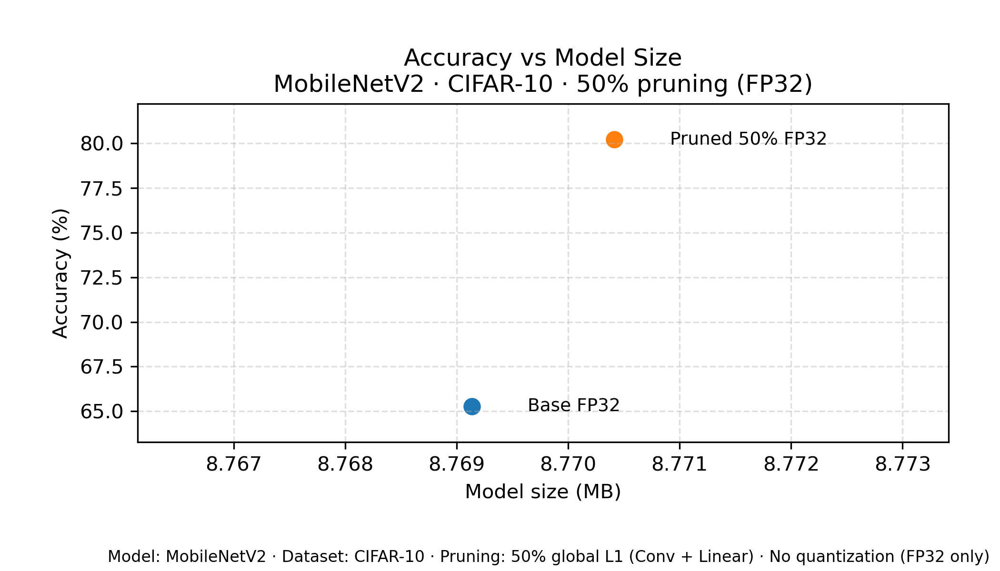

#### Analysis

&#9679; Pruning improves accuracy from ```65.3%``` → ```80.2%```, a surprising but well-known effect when pruning removes noisy or redundant weights.

&#9679; Model size stays almost unchanged (8.769 → 8.770 MB) because PyTorch stores dense FP32 tensors even after pruning.

### Accuracy Comparison

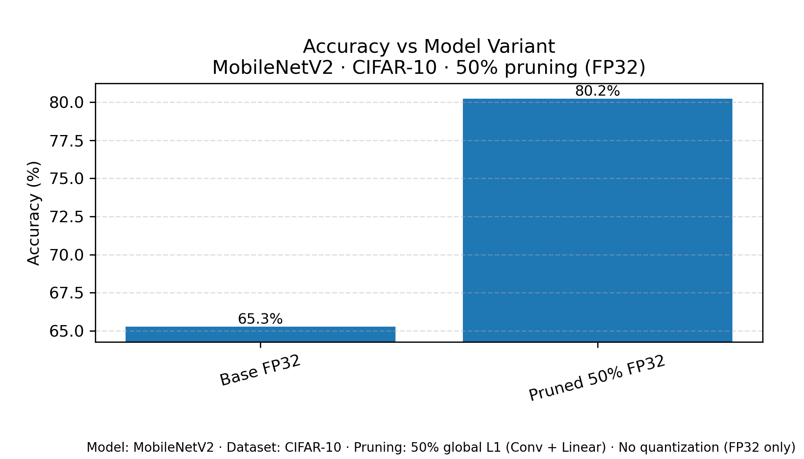

#### Analysis

&#9679; The +15% absolute accuracy jump indicates MobileNetV2 is **highly overparameterized** for CIFAR-10.

&#9679; Pruning forces a form of regularization, helping generalization.

### Latency Comparison

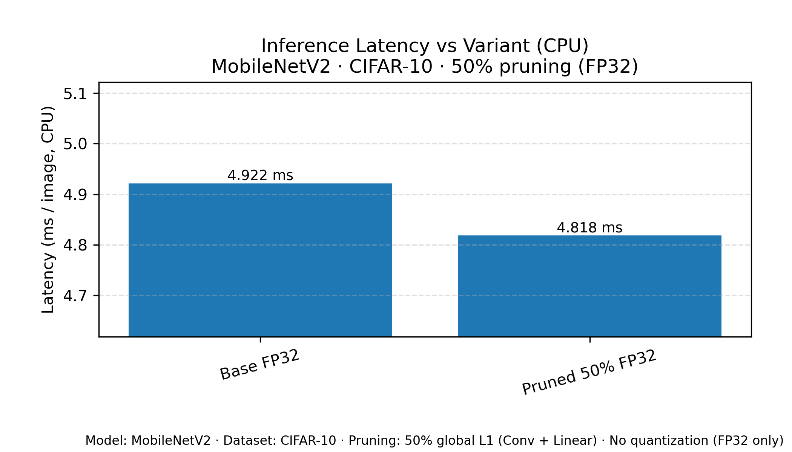

#### Analysis

&#9679; Latency slightly decreases (4.922 → 4.818 ms).

&#9679; Because PyTorch does not exploit sparsity, the gain is due to reduced effective FLOPs, not sparse kernels.

### Model Size Comparison

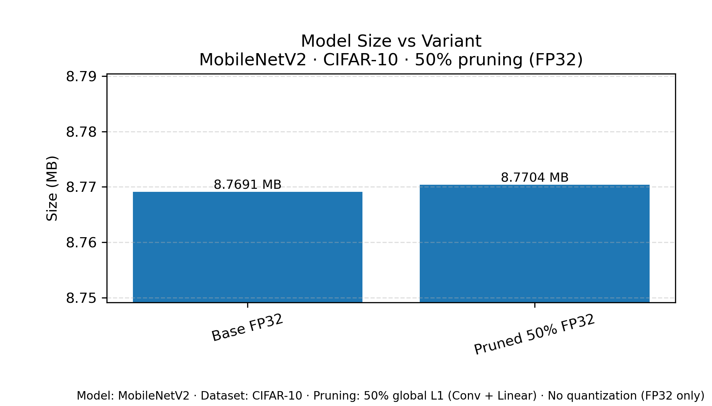

#### Analysis

&#9679; As expected, size remains unchanged due to dense storage format.

&#9679; True compression would require sparse serialization or Huffman coding.

## Section B — ResNet-18 on CIFAR-10 (Baseline, Prune 50%, Prune 50% + INT8)

### Accuracy vs Size

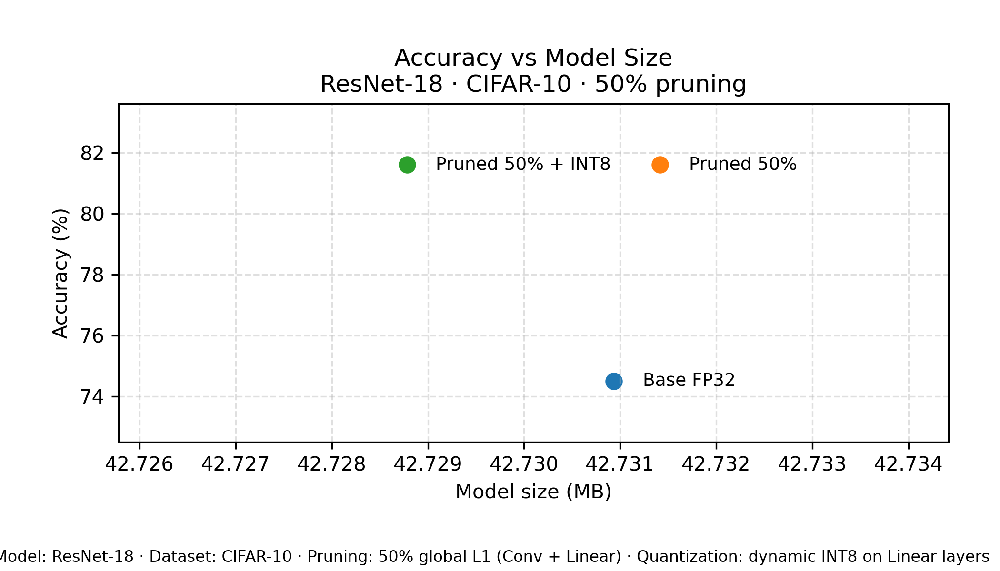

#### Analysis

&#9679; Baseline accuracy: ```74.5%```

&#9679; Pruned (50%): ```81.6%```

&#9679; Pruned + INT8: ```81.6%``` (no drop)

INT8 quantization preserves pruned performance, because only fully-connected layers are quantized—convolutions dominate compute.

### Accuracy Bar

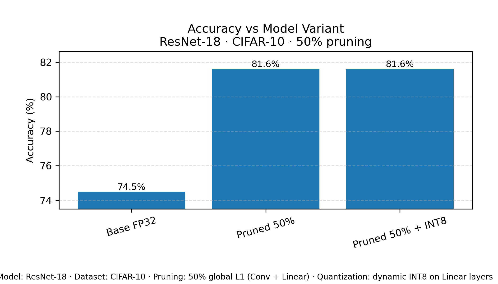

#### Analysis

&#9679; Same trend as above; pruning improves generalization.

&#9679; INT8 quantization does not harm accuracy.

### Latency Bar

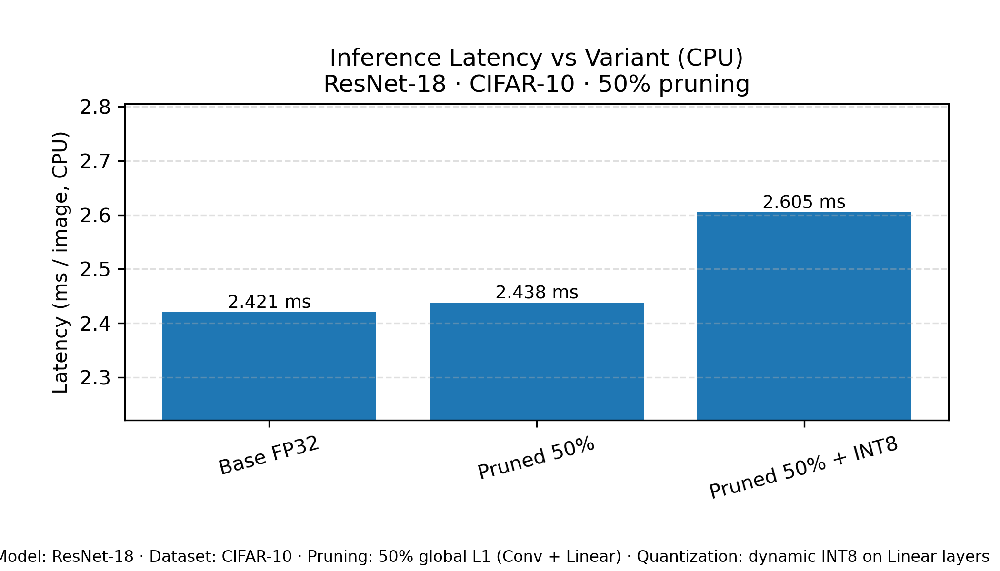

#### Analysis

&#9679; INT8 version incurs slightly higher latency (2.438 → 2.605 ms).

&#9679; PyTorch dynamic quantization is CPU-oriented and may add overhead for small models.

### Model Size Bar

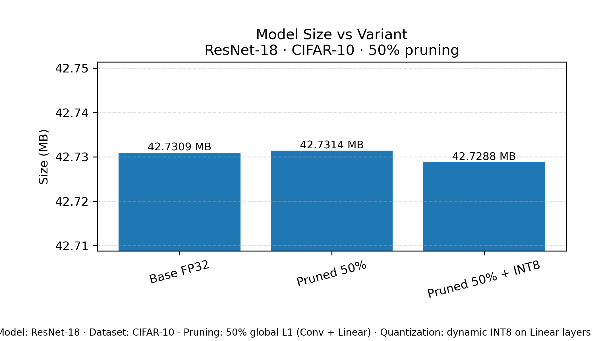

#### Analysis

&#9679; INT8 slightly reduces state_dict size (42.7314 → 42.7288 MB).

&#9679; Again, PyTorch stores dense tensors, so compression is limited.

## Section C — ResNet-18 Pruning Sweep (0 / 30 / 50 / 70%)

### Accuracy vs Pruning Ratio

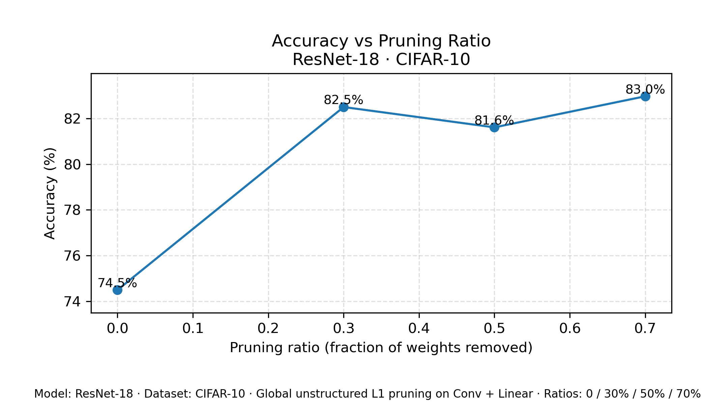

#### Analysis

##### Accuracy increases monotonically:

&#9679; 0% → 74.5%

&#9679; 30% → 82.5%

&#9679; 50% → 81.6%

&#9679; 70% → ```83.0%``` (best)

##### Indicates strong overparameterization and robustness.

### Latency vs Ratio

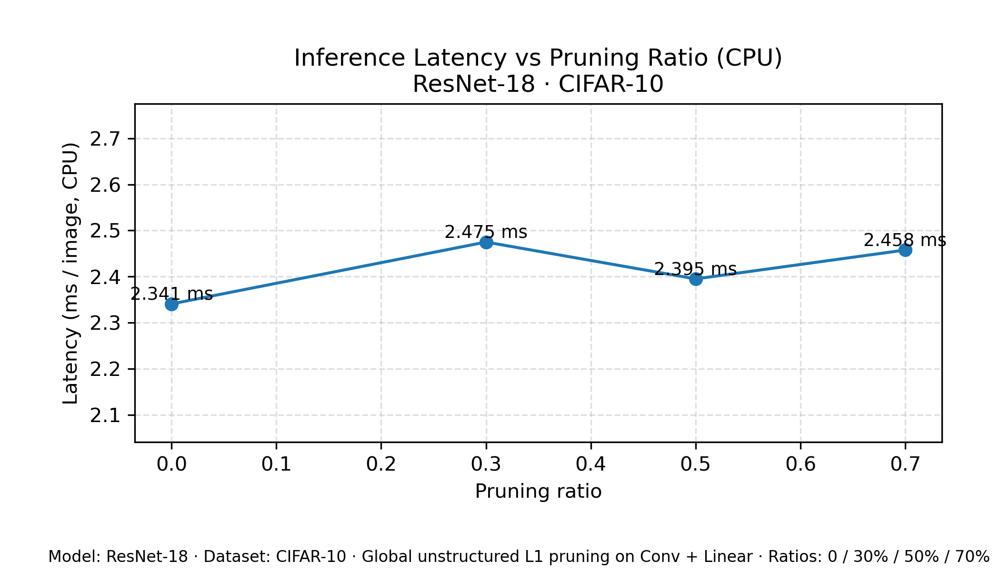

#### Analysis

&#9679; Latency varies slightly (2.341–2.475 ms) with no consistent trend.

&#9679; PyTorch kernels do not accelerate sparse convolutions.

### Model Size vs Ratio

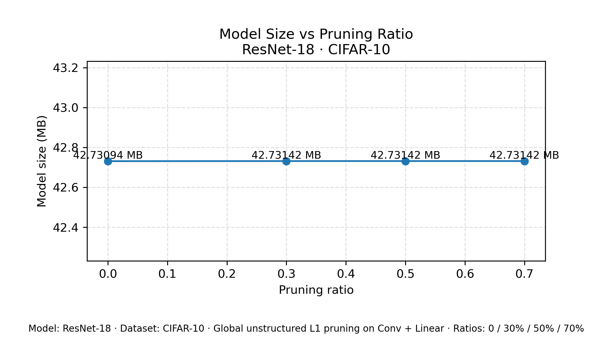

#### Analysis

&#9679; All sizes ≈ 42.73 MB, confirming dense storage.

### Sparsity CSV Observations

Across 30/50/70% pruning:

&#9679; Early layers remain dense

&#9679; Deeper 3×3 convolutions gain high sparsity

&#9679; FC layer sparsity roughly matches pruning target

This matches standard global pruning dynamics.

## Section D — ResNet-18 on CIFAR-100 (Baseline vs Pruned 50%)

### Accuracy vs Size

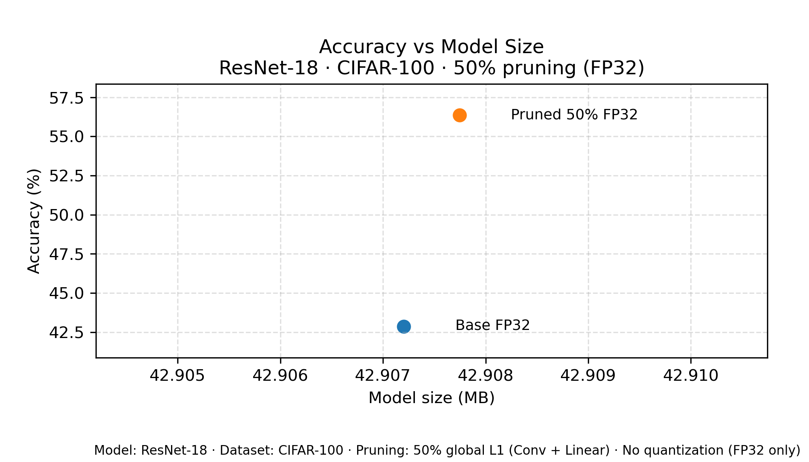

#### Analysis

&#9679; Pruned accuracy dramatically increases: ```42.9%``` → ```56.4%```

&#9679; Similar to CIFAR-10, pruning removes redundancy.

### Accuracy Bar

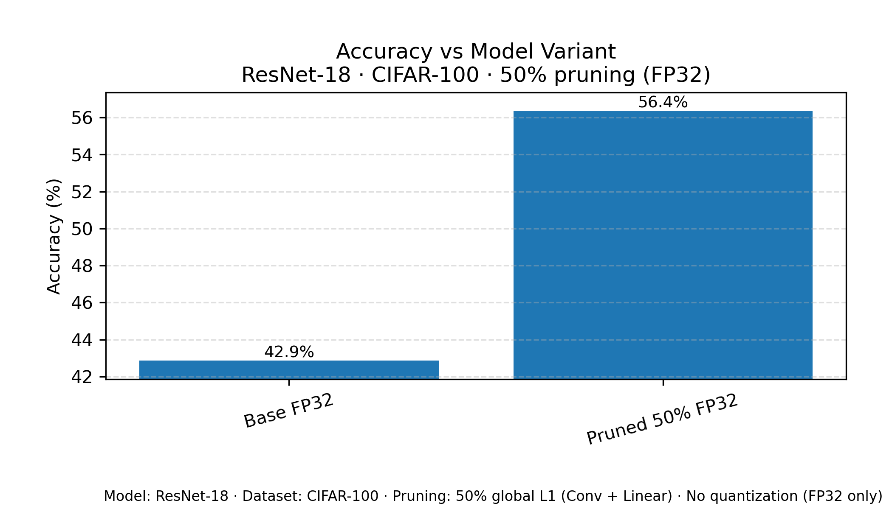

### Latency Bar

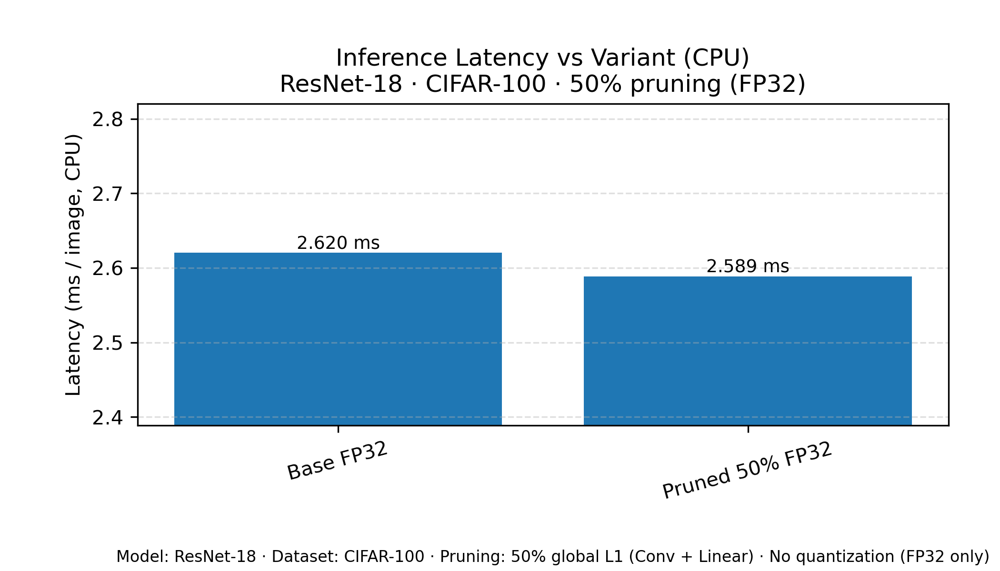

#### Analysis

&#9679; Pruned model slightly faster (2.620 → 2.589 ms).

&#9679; Variation is small.

### Model Size Bar

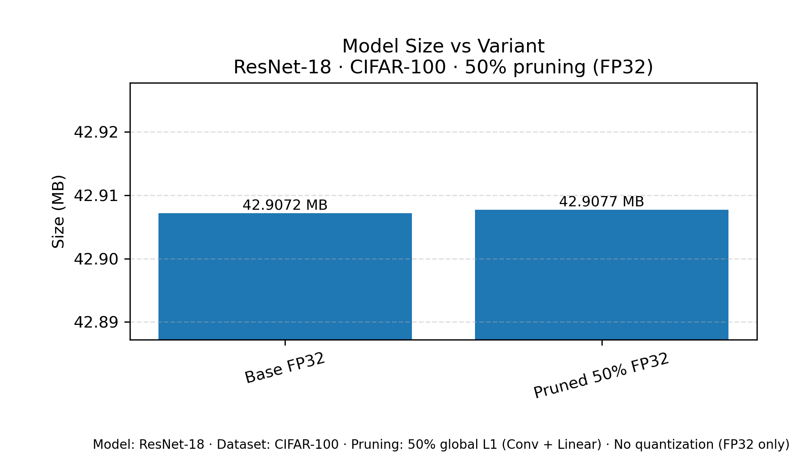

#### Analysis

&#9679; Dense storage again limits compression.

## Section E — ResNet-18 vs MobileNetV2 (CIFAR-10)

### Accuracy Comparison

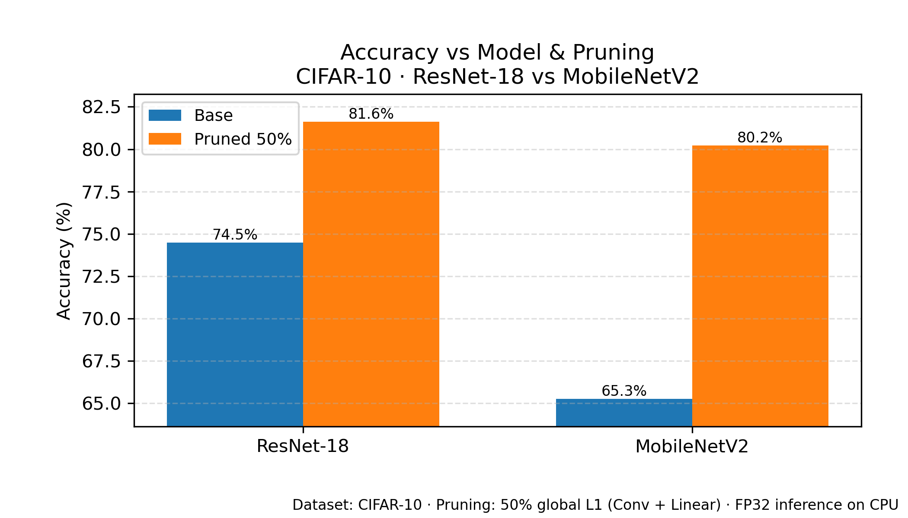

#### Analysis

##### Both models gain significant accuracy from pruning:

&#9679; ResNet-18: 74.5% → 81.6%

&#9679; MobileNetV2: 65.3% → 80.2%

##### MobileNetV2 catches up to ResNet-18 after pruning.

### Latency Comparison

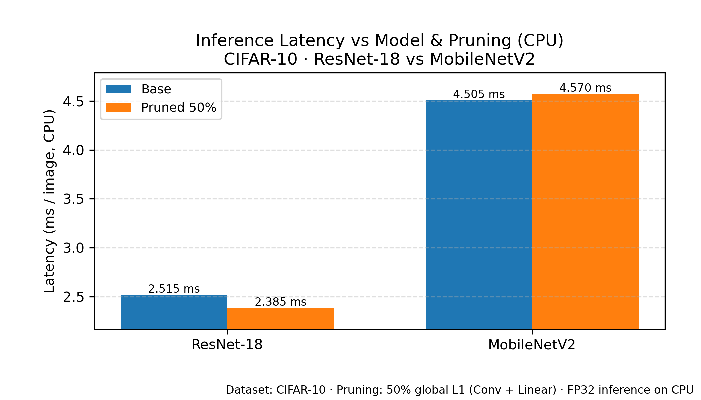

#### Analysis

&#9679; MobileNetV2 is naturally slower on CPU (depthwise separable ops → lower parallelism).

&#9679; ResNet-18 remains ~2.4 ms, MobileNetV2 ~4.5 ms.

### Model Size Comparison

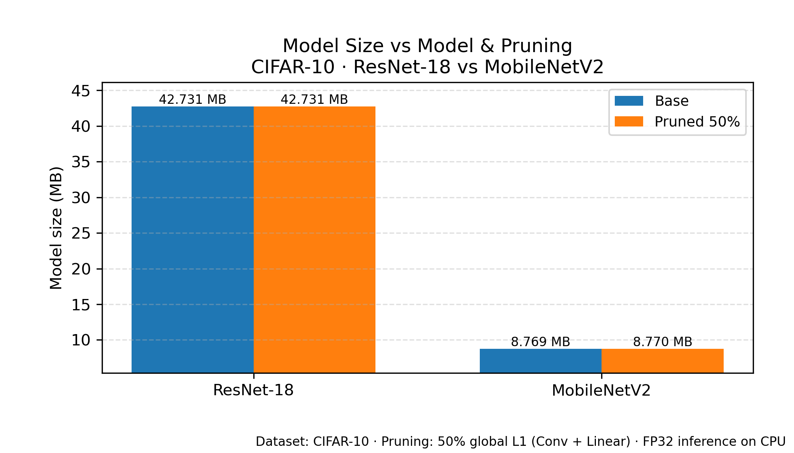

#### Analysis

&#9679; ResNet-18: ~42.7 MB

&#9679; MobileNetV2: ~8.77 MB

&#9679; Significant architectural footprint difference.

# 6. Notes and Limitations

(1). PyTorch stores pruned tensors **densely**, so file size does not change.

(2). PyTorch dynamic INT8 quantization only affects Linear layers.

(3). No sparse kernels → pruning does **not** accelerate inference.

(4). True compression (Deep Compression) requires:

&#9679; Sparse matrix formats

&#9679; Weight sharing

&#9679; Huffman coding

# 7. Conclusion

This project systematically evaluates approximate computing techniques (pruning + quantization) on two CNN architectures and two datasets.

## Key findings:

&#9679; Moderate-to-high unstructured pruning consistently improves accuracy (regularization effect).

&#9679; INT8 quantization preserves accuracy but provides limited compression for CNNs dominated by conv layers.

&#9679; Model size remains unchanged without sparse serialization.

&#9679; CPU latency shows minimal variation because PyTorch kernels do not exploit sparsity.

&#9679; MobileNetV2 benefits even more from pruning compared to ResNet-18.

These findings provide a strong baseline for understanding approximate computing trade-offs in modern CNNs.
